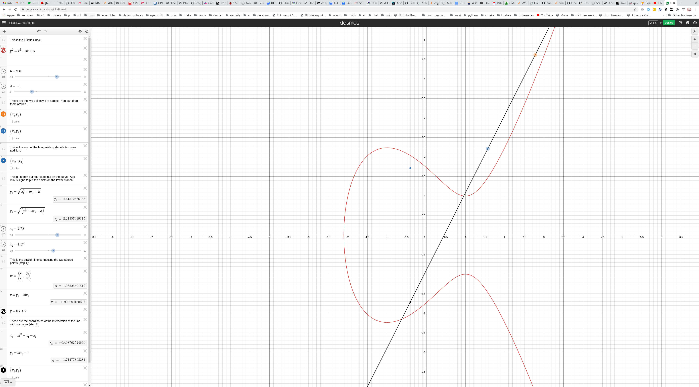

## Elliptic Curve Cryptography (EC)

The main motivation for using/developing EC, remember that we already have
algorithms that use the discrete logarithm problem. Well it turns out that with
EC we can have smaller operands but still the same amount of security. Remember
that the key lenghts don't always correspond to the actual level of security due
to various attacks available. So we need to increase the sizes to still get the
same level of actual security. But with greater key sizes the computations
become more compute intensive and less efficient (like more power on devices
and CPU time). 

We can do public key exchange, encryption, and digital signatures with EC.

The idea is to find another cyclic group where the discrete logarithm problem
is difficult, preferrably more difficult than the cyclic group of `Zp^*`.

Lets start with the following polynomial, which is a circle:
```
  x² + y² = r²
```
So we have a point on the circle `p(x, y)` and the radius is r.
```
0.707² + 0.707² = 1
```
Now, if we add cofficients to x and y we get an ellipse:
```
  ax² + by² = r²
```
The two examples above deal with real numbers.
For crypto we need to consider polynomials in `Z_p`.

### Definition
```
y² = x³ + ax + b mod p

We also need an imaginary point at infinity, where a,b ∈ Zp and 
4a³ + 27 b² != 0 mod p  (these curves cannot be used in crypto)
```

Without using mod p we can visualize this (this is not possible when using
the modulo operation, the visual collapses), for example:
```
y² = x³ - 3x + 3
```
You can try this out at https://www.desmos.com/calculator/ialhd71we3



And to get the value of y we square:
```
y² = x³ + ax + b
      ____________
y  = √ x³ + ax + b
```

Just to get a feel for this lets plug in x=1:
```
x = 1
y² = 1³ - 3*1 + 3
y² = 1 - 3 + 3
y² = -2    + 3
y² = 1
y  = √1
y  = +- 1
```
And if we look at the graph we can see that (1, 1) and (1, -1) are both valid
points on the curve. The `+-` shows the symmetry of the curve, the points are
reflected.

Now, we need a `cyclic` group for the descrete logarithm problem.
The set of `group elements` are the `points` on the curve, and we need to be
able to compute with these elements, much like we computed with integers earlier.
This is the group operation and previously we used multiplication.

So for a group we need:
* a set of elements. These are the points on the curve.
* a group operation (+).
* the group operation must be closed (can't add points and suddenly have a points
that is off the curve.
* the group operation must be associative.
* there must be an element called the neutral/identity element.
* for each element in the group thre must be an inverse of each element.

### Group operation
This is the addition of points (group elememts) on the curve.

So we want to be able to add points together.
```
P =  (point on the curve which will have an x and y coordinate)
Q =  (point on the curve which will have an x and y coordinate)

P + Q = ?
```
We can visualize this (again without mod p). Draw a line between from the first
point to the second and let it extend through the second point and continue. It
will intersect with the curve at some point when we do this. Now, remember we
mentioned that the curve is symmetric, so we reflect (multiple by -1?) which
gives as the point R. So R = P + Q. 
This is the definition of the group operation.

Now, think about the point P and what if we want to add the same point with
itself, like 1 + 1 = 2. We can't draw a line from the point to itself, there
will be no intersect point that we can reflect.

Now, there are two different cases we have to consider
```
1) Point addition (what was described above)
   R = P + Q

2) Point doubling
   For this we have to take the tagent and see where it intersects with the
   curve, and then reflect that point.
```

So that was a nice visual but how do we actually compute these points.
Well we have to compute the line between the two points and we know the two
points (just to make that clear):
```
P = (x₁, y₁)
Q = (x₂, y₂)

y = sx + m

Where s is the slope we can get by taking (for point addition):

    y₂ - y₁
s = -------- mod p
    x₂ - x₁ 

And for point doubling:
 
    3x₁² + a
s = -------- mod p
      2y₁
```

Now we need to find the intersection with the curve after finding the line.
```
E: y² = x³ + ax + b
l: y  = sx + m

l = E
(sx + m)²            = x³ + ax + b
(sx + m)(sx + m)     = x³ + ax + b

sx² + sxm + sxm + m² = x³ + ax + b
s²*x² + 2smx + m²    = x³ + ax + b
```
So we can see that we have an equation with degree 3 so we have 3 solutions,
x₁, x₂, and x₃.
```
x₁ is the x value of point P(x₁, y₁)
x₂ is the x value of point Q(x₂, y₂)
x₃ is the x value of the intersect point R(x₃, y₃)

x₃ = x² - x₁ - x₂ mod p
y₃ = x(x₁ - x₃) - y₁ mod p
```

We can avoid division to calculate the slope by using:
```
 y₂ - y₁
 -------  mod p     -> (y₂ - y₁)(x₂ - x₁)⁻¹ mod p
 x₂ - x₁
```
Which is the extended Euclidean algorithm.

To be a group we need to fulfill the requirements that the group operation
is closed, associative. This is done using the modulo operation.

### Identity element
There also has to be an `identity` element such that a + 1 = 1 + a = a. What is
this identity value of this group?  

So we need something to fullfill:
```
P + (some point) = P
```
With natural numbers we would have 0 as this identity element, but remeber that
the addition operation is very different in this case. We have to choose a
second point on the curve, then "draw" a line to the that point, invert that
point, and that is supposed to land on the original point.

It turns out that there is no point that we can calculate using the above steps
and get this 0/NUll point, instead one has been `defined` (artifically made up).
This is "point at infinity" which uses the symbol `ó`.

Group identity:
```
P + ó = P
```
To try to visualize this think that the point is on the curve (look at the curve
above, the image) and lets say the point in the at (-1, 2). So then imaging
the point of inifity as going straight down to (-1, -2) which is then our second
point. If we now reflect that back it will end up at (-1, 2)  which is our
original point.


The negative/inverse (opposite) of `P` is:
```
-P  of P(x, y) is -P = (x, -y)
                  ↑        ↑
                  |        normal `-`, so just the negative y value
                  |
                 Not the normal `-`, this is the negative/inverse of the group operation
```

### EC Discrete Logarithm Problem (EC-DLP)
Elliptic curve has a cyclic group (not all curves form a cyclic group), for
example:
```
E: y² = x³ + 2x + 2 mod 17
```
For the group to be cyclic we need a `generator/primitive` element which can
generate points on the curve.

An example of a generator/primitive element is:
```
Primitive Element P = (5, 1)    // (x, y)

       +------------------------------------------------+
       ↓                                                |
2P  = (5, 1) + (5, 1)  = (formula from above) = (6, 3)  |
3P  = 2P + P           = (formula from above) = (10, 6) |
                      ...                        +------+
                                                 ↓
18P = 17P + P          = (formula from above) = (5, 16)
```
Notice that for `18P` we have the same x coordinate, `5` as the primitive
element. And the `16` is the inverse mod p of 1:
```
-1 ≡ 16 mod 17

18P = (5, 16) = (5, -1)
```
And `(5, -1)` is then `-P`, the inverse of P.
```text
19P = 18P + P = (5, 16) + (5, 1)
```
But we have to check that the `y` coordinates are the inverse of each other.
```text
19P = 18P + P = (5, 16) + (5, 1)
              =   -p    + p      = ó the neutral element for the group.
```
The neutral element (or point of infinity) can be thought of as 1 in a
multiplicative group, or 0 in an additive group.
```text
20P = 19P + P = ó  + P           = P
```
So just like adding 0 an integer does not affect the integer.
```test
21P = 20P + P  = P   + P  = 2P     = (6, 3)
22P = 21P + P  = 2P  + P  = 3P     = (10, 6)
```
And notice that we are cycling through the group.

Notice that the order (number of elements in the group) are 19 in this case
```text
1P  = (5, 1)
2P  = (6, 3)
3P  = (10, 6)
4P  = (3, 1)
5P  = (9, 16)
6P  = (16, 13)
7P  = (0, 6)
8P  = (13, 7)
9P  = (7, 6)
10P = (7, 11)
11P = (13, 10)
12P = (0, 11)
13P = (16, 4)
14P = (9, 1)
15P = (3, 16)
16P = (10, 11)
17P = (6, 14)
18P = (5, 16)
19P = ó

20P = 2P
21P = 3P
23P = 4P
24P = 5P
```

Lets take a concrete example of point doubling, so we want to do 2P, or P + P:
```
Point P: (5, 1)

   y² = x³ + a*x + b mod p

E: y² = x³ + 2*x  + 2 mod 17

Lets start by getting x₃ (which is R(x₃, y₃))
x₃ = s² - x₁ - x₂ mod p

For this we need to calculate the slope using:

    3x₁² + a
s = -------- mod p
      2y₁

So we plug in the values:

     (3 * 5)² + 2
s = ------------- = (3*5²+2)(2*1)⁻¹ = (77)(2)⁻¹
       2 * 1       

s = (77)(2⁻¹) = (77 mod 17)(2⁻¹ mod 17)
s = (77)(2⁻¹) = (9)(2⁻¹ mod 17)
Now we have to find the modular inverse 2⁻¹ mod 17
Recall that 2⁻¹ mod 17 is asking for a number k such that 2k = 1 (mod 17)
{0, 1, 2, 3, 4, 5, 6, 7, 8, 9, 10, 11, 12, 13, 14, 15, 16}
2 * 0 mod 17 = 0
2 * 1 mod 17 = 2
2 * 2 mod 17 = 4
2 * 3 mod 17 = 6
2 * 4 mod 17 = 8
2 * 5 mod 17 = 10
2 * 6 mod 17 = 12
2 * 7 mod 17 = 14
2 * 8 mod 17 = 16
2 * 9 mod 17 = 1  <------- Found the inverse

s = (9)(9) = (81) = (13 + 4 * 17) ≡ 13 mod 17

So we can now use the value s, which is 13 in the following equation:
x₃ = s² - x₁ - x₂ mod p

x₃ = 13² - 5 - 5 mod 17
x₃ = 13² - 5 - 5 mod 17
x₃ = 169 - 10    mod 17
x₃ = 159         mod 17 = 6
x₃ = 6
```

So that gives us `x₃`, now we need to find `y₃` using `x₃` and `s`:
```text
y³ = s(x₁ - x₃) - y₁ mod p
y³ = 13(5 - 6)  - 1  mod 17
y³ = 65 - 78    - 1  mod 17
y³ = -14             mod 17
y³ = 3

And the gives us (x₃, y₃) = (6, 3)
```

### Elliptic Curve Discrete Logarithm Problem (ECDLP)
We have an eliptic curve and a primitive element (generator), and remember that
this is required for a cyclic group, and we have another element T.

The generator is able to generate all points in the group/curve. So T is one
of those points that can reached by performing the group operation on the
generator a specific number of times.

```text
    [ d number of times we use the group operator `+`]
T = P + P +                                   ... + P  = dP 

T = element in the group/set
P = generator element
d = number of times we perform the group operation to generate/get T.
```

Now the DL problem is: given P, find the value of `d`, the number of times we
did `P + P` to get to `T`.

So we would know `P` and `T`, and want to find out how many times `P` was added
to get to `T`.

To visualize this we are given the starting point, the generator. And we are
also given T which is destination/final point. And d is the number of hops to
get there.

So to generate T, the public key, it looks like we only need to perform `dP`.

`T` is the `public key` in crypto, and `d`, the number of jumps,
group operations, on the curve is the `private key`.

```text
P = (5, 1)                  primitive element/generator
T = (16, 4) = d * P         there exists an integer d that produces (16, 4)
  = (16, 4) = d(5, 1)       d = ?
```
In this case `d` is 13 but that was by looking at the table above in this doc:
```text
13*P = (16, 4)
```
So the private key, `d` is just a simple integer which is the number of
hops/jumps/group operations. This is true for all DL problems regardless of the
group used.

In contrast `T`, the public key, is a point on the curve (group element) and in
general for any DL `T` is the type of the group element type. This is also the
case for all DLPs that the public key is of the same type as the element of the
group, but again the private key is just an integer.

### Cardinality
The number of elements in the group is called the cardinality/order of the
group. Is written as `#En`.

In our example we have 18 actual points, but the cardinatlity is 19 which is
written as `#E=19`. `The additional point is the point of infinity`.

Hasses theorem (bound) gives as an upper and lower bound for `E`.
```text
#E ≈ p

#E    p+1 +-2√p

         160 bits
  +------------------------
p |                       |
  +-----------------------+
           ||             |
            +-------------+
           1 +   80 bits (√180)
          (2 time a number adds one bit)
```
This is an approximation and is helpful but to get the exact value the
computation is quite complex/expensive. This is one reason that standard curves
are defind. For example, NIST defines standard curves and these specify the
number of points on the curve as part of the standard.

## Standard Curves
Standard curves provide different curves equations, and also specify the
generator element, and the cooficients `a` and `b`.
```
   y² = x³ + ax + b mod p
```
Then we chose values for our private key, which is d, and compute (hop/jump)
T our public key.


### How hard is it to break ECDLP
Currently known attacks require about √p steps.

For example:
```text
p ≈ 2¹⁶⁰
√2¹⁶⁰ = 2¹⁶⁰/² = 2⁸⁰
```
2⁸⁰ is estimated to take 1 million years with the currently existing computers,
and it is thought that these will remain unbreakable for about 15-20 years. For
this reason a larger prime number is chosen, perhaps with 196 or 256 bits to
hopefully be secure for longer than that.

### ECDH
So with ECDLP we can now take a look at the Diffie-Hellman key exchange and this
time use ECDLP for it:

We have a setup phase where we "create/generate/find" the domain parameters
Setup phase:
```text
  E: y² = x³ + ax + b mod p         We chose the curve
  P = (x_p, y_p)                    We choose the primitive element/generator
```
This could also be done by choosing a standard curve.

Protocol phase:
```text
d = private key (called a and b in this example)
T = public key (called A and B in this example)
#E = the number of elements in the group

Alice                                      Bob
               { random      }                            { random      }
a = Kpiv = A ∈ {2, 3,...,#E-1}             b = Kpiv = B ∈ {2, 3,...,#E-1}
(a is an integer)                          (b is an integer)

A = Kpub = aP = (x_A, y_A)                 B = Kpub = bP = (x_B, y_B)
(A is a point on the curve)                (B is a point on the curve)
(P is the generator)                       (P is the generator)

                                 A
                          ---------------->
                                 B
                          <----------------
a*B = (x_AB, y_AB)                         b*A = (x_AB, y_AB)
a = integer, private key                   b = integer, private key
B = point on the curve, Bob's public key   A = point on the curve, Alice's public key
```
Notice that they both computed the same point on the curve.
`a*B` will give alice a point on "her" curve. And `b*A` will give bob a point
on "his" curve. 

Notice that they are both calculating the same thing:
```
a*B = a(bP) = a*b*p

b*A = b(a*P) = a*b*p
```
They can now use either the `x` or the `y` value for encryption, for example as
the key in AES:
```

 C = AES(message, X_AB)   ---------C------> AES⁻¹(C, x_AB) = message

C = cipher text
```

Recall that the private key is an `integer` and the public keys are `points` on
the curve. So `a*B` is a scalar multiplication and not point addition or point
doubling which mentioned earlier in this document.

```
a * P                          P = point on curve
```
Recall that `*` in this case is the group operation which is just a shorthand
notation for:
```
a * P = P + P + P + P (a times)
```
For very large numbers (private keys) we can use square-and-multiply but in EC
the squaring becomes `P+P`, point doubling, so instead of square-and-multiply
double-and-add.

## Domain parameters
ECC can use different curves and depending on the curve chosen the cryptological
strenght of the algoritm is effected. Also the performance of the algorithm is
effected by the curve chosen as is the key length. These are called/defined as
domain parameters:
* name of the curve
* key length
* strength of the algorithm which is normally key-length/2
* performance 


## Standard/Named Curves
Standard curves have been defined by NIST, SECG, and ECC Brainpool.
These standards define domain parameter for usage.

### National Institute of Standards Technologies (NIST) Curves
Spec: https://nvlpubs.nist.gov/nistpubs/FIPS/NIST.FIPS.186-4.pdf
https://neuromancer.sk/std/nist/

Examples:
```
P-224
P-256
P-512
```

Note that NIST has approved a number of SECG curves so there are some
overlapping curves.

## Standard for Efficient Cryptography Group (SECG)
[secg](https://secg.org/) was founded in 1998 and this group has produced a
number of standards, for example:

* [SEC1](https://secg.org/sec1-v2.pdf) Elliptic Curve Cryptography (2.0)
* [SEC2](https://secg.org/sec2-v2.pdf) Recommened EC Domain parameters (2.0)
* [SEC4](https://secg.org/sec4-1.0.pdf) EC Qu Implicit Certificate

Notice that SEC1 contains the elliptic curve algoritm.

### SEC1
This is a standard that includes the ECC schemas, like signature, encryption,
and key agreement.

### SEC2
This spec deals with the domain parameters which can be used with the schemas
defined in SEC1 (I think).
This does not mean that the curves are defined in this document but it does
specify how curves should be used.

https://neuromancer.sk/std/secg/
Examples:
```
secp192r1          192 key length
sect233k1          322 key length
secp224k1          224 key length
secp256k1          256 key length

The r in secp256r1 stands for random.
The k in secp256k1 stands for Koblitz.
```
The difference between random and Koblitz is that the Koblitz domain
parameters have some special properties that allows the group operation to be
implemented in a more performat manner. The actual curve is in the same form for
both of these but it is the cooffients that are the following:
Koblitz:
```
a = 0
b = 7
```
Random:
```
a = FFFFFFFF 00000001 00000000 00000000 00000000 FFFFFFFF FFFFFFFF FFFFFFFC
b = 5AC635D8 AA3A93E7 B3EBBD55 769886BC 651D06B0 CC53B0F6 3BCE3C3E 27D2604B
```
Apparently there are concerns that the random values might actually provide a
a backdoor.  Bitcoin chose Koblitz for performance.

## ECC Brainpool
https://tools.ietf.org/html/rfc5639
https://neuromancer.sk/std/brainpool/

Examples:
```
brainpoolP512t1
```

## ANSI x9.62
https://neuromancer.sk/std/x962/

Examples:
```
prime256v1      (which is the same as P-256 and sepc256r1)
```

### Point Compression
As mentioned earlier the public key is a point on the curve, calculated by using
the generator/base element times the private key (integer). Being a point means
that it has an x and y coordinate. Instead of sending both the x and y
coordinate only one of them can be sent, and the other can be solved for. My
understanding is that the x coordinate is sent and a bit that specifies if the
y coordinate is positive or negative. The receiver can then solve for y and will
get two valid values for y but knows by inspecting the bit which it should use.


### Prime order groups
Are groups with a prime number of elements. Every element can generate/reach
all the other elements in the group, except zero.

### Order
Order refers to the number of elements in a group, but order is also used when
talking about how many elements a given element can generate/reach.

### Cofactor
Now, what we would like is to have a group which as an order or a large prime,
but the simpler and more efficient EC curves don't provide that.k


### EcdsaP256Sha256
This specified that ECDSA which is specified in
[SEC1](https://www.secg.org/sec1-v2.pdf) is to be used. And that the domain
parameters for that algorithm are to be taken from `P-256` which is
defined in
[FIPS-186-4](https://nvlpubs.nist.gov/nistpubs/FIPS/NIST.FIPS.186-4.pdf#page=111)
or in [SEC2](https://www.secg.org/sec2-v2.pdf) (under the name `secp256r1`).
And that the hashing algorithm needs to be SHA-256.

__wip__

### ecPublicKey
Is the name/description of the asymmetric encryption algorithm for ECC which
has the following object identifier:
```
1.2.840.10045.2.1 
```
### Weirstrass curve/form
```
^
y² = x³ + ax + b
```

### Montgomery curve
Was published in 1987 by Peter L. Montgomery
